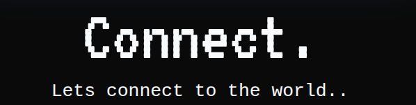
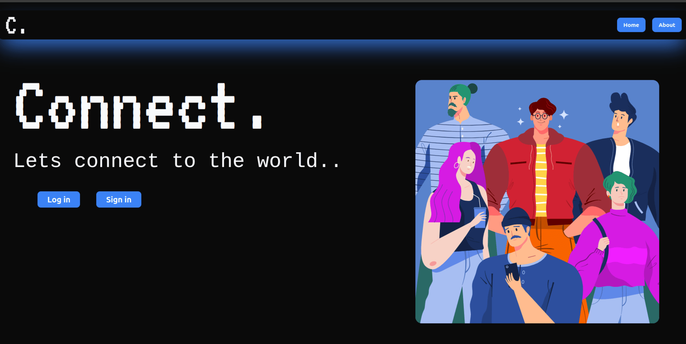
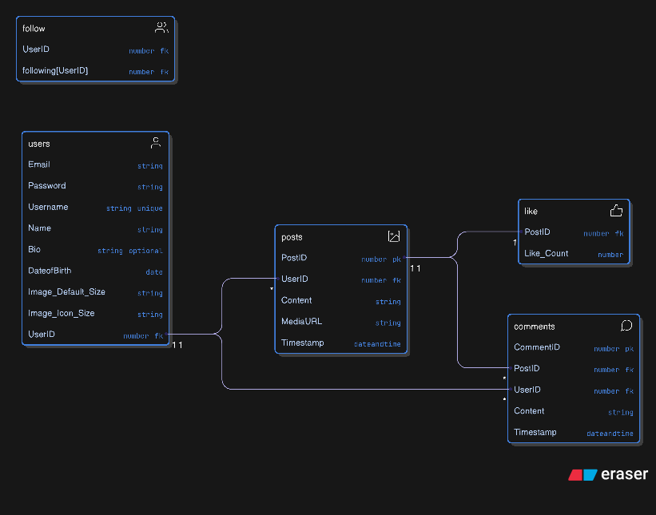

<h1>
  
  Connect.
</h1>

Connect is a social media platform built with DRF & TS.

  
  
  
  
  
  

  

**Connect to your Friends and interact with them**

## Preview

  

## 🚀 Tech Stack

| Logo                                                                                                                         | Technology                      | Intended Use                                                                 |
| ---------------------------------------------------------------------------------------------------------------------------- | ------------------------------- | ---------------------------------------------------------------------------- |
|              | **React**                       | Frontend UI library for building dynamic, component-based user interfaces.   |
|  | **React Router**                | Client-side routing for navigating between pages without reloading.          |
|       | **TailwindCSS**                 | Utility-first CSS framework for fast, responsive styling.                    |
|                                                                     | **shadcn/ui**                   | High-quality headless UI components for consistent, modern interface design. |
|                     | **Zod**                         | Schema validation + TypeScript inference for form data.                      |
|           | **React Hook Form**             | Fast, optimized form handling with built-in validation.                      |
|    | **TypeScript**                  | Strongly typed JavaScript for more robust frontend code.                     |
|            | **Python**                      | Backend programming language to build the API logic.                         |
|               | **Django REST Framework (DRF)** | Backend API framework for authentication, serialization & business logic.    |
|            | **Pytest**                      | Testing backend logic, endpoints, models & utilities.                        |
|           | **JWT**                         | Token-based authentication for secure login & session handling.              |
|          | **Postgres**                    | High Performance SQL Database.                                               |

## 🛢️ Database Schema

  

## Features

- Create or Delete Account
- Login (JWT Authenticated)
- Add or Delete Post
- See Your Posts
- View Latests Post from the People you follow
- Update and Edit Profile
- Search for other Users
- Follow other Users
- See Following/ Follower List/Count

### Checkout `/api/v1/docs/` for swagger api docs
